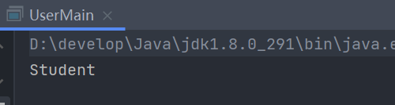

&emsp;&emsp;@Named 和@Inject 注解是 JSP330 提供的。@Named 注解相当于 Spring 的@Component，@Inject 相当于@Autowired。

&emsp;&emsp;@Inject 和 @Named 这两个注解没有包含在 JRE 中，需要额外导入依赖包。

```xml
<dependency>
    <groupId>javax.inject</groupId>
    <artifactId>javax.inject</artifactId>
    <version>1</version>
</dependency>
```

## @Named

&emsp;&emsp;@Named 使用在属性和参数上，作用是根据名字查找容器中对应的对象；也可以使用在类上，用于对该类进行组件的标注，功能类似于在 XML 文件中配置 Bean。

&emsp;&emsp;与 XML 配置一样，如果不指定 Bean 的名字，默认一首字母小写的类名作为 Bean 的名字。

## @Inject

&emsp;&emsp;@Inject 是 JSR330 中的规范，通过 AutowiredAnnotationBeanPostProcessor 类实现的依赖注入，用于自动装配。

&emsp;&emsp;如果有多个相同类型的 Bean，则使用 @Named 注释来解决冲突。

&emsp;&emsp;@Inject 可以使用在构造函数、属性和属性的 setter 方法上，用来注入依赖对象。

1. 在属性上注解

- 属性不能是 final 的
- 拥有一个合法的名称

2. 在方法上注解

- 不能是抽象方法
- 不能声明自身参数类型
- 可以由返回结果
- 拥有一个合法的名称
- 可以有 0 个或多个参数

&emsp;&emsp;@Inject 注解的属性、函数和方法，默认会以属性或参数的名称查找容器中的对象。参数也可以结合@Named 注解，指定需要注入的 Bean 的名字。

&emsp;&emsp;如果 Bean 没有找到，则容器初始化时会抛出 UnsatisfiedDependencyException 的异常提示。

## @Named、@Inject 使用方法

### 在 Setter 方法上注解

> User.java

```java
@Named
public class User {
    public String getUserInfo() {
        return "user info";
    }
}
```

> UserService.java

```java
@Named
public class UserService {
    private User user;

    public User getUser() {
        return user;
    }

    @Inject
    public void setUser(User user) {
        this.user = user;
    }
}
```

> AppConfig.java

```java
@Configuration
@ComponentScan(basePackages = "com.staven.anno")
public class AppConfig {
}
```

> UserMain.java

```java
public class UserMain {
    public static void main(String[] args) {

        AnnotationConfigApplicationContext context =
                new AnnotationConfigApplicationContext();
        context.register(AppConfig.class);
        context.refresh();

        UserService userService = context.getBean(UserService.class);
        System.out.println(userService.getUser().getUserInfo());

        context.close();
    }
}
```

&emsp;&emsp;运行 UserMain.java，结果为：


### 在 Constructor 上注解

> UserService.java

```java
@Named
public class UserService {
    private User user;

    @Inject
    public UserService(User user) {
        this.user = user;
    }

    public User getUser() {
        return user;
    }
}
```

&emsp;&emsp;运行 UserMain.java，结果为：


### 在属性上注解

> UserService.java

```java
@Named
public class UserService {
    @Inject
    private User user;

    public User getUser() {
        return user;
    }
}
```

&emsp;&emsp;运行 UserMain.java，结果为：


### 使用 avax.inject.Provider

> UserService.java

```java
@Named
public class UserService {
    @Inject
    private Provider<User> userProvider;

    public User getUser() {
        return userProvider.get();
    }
}
```

### 精确匹配依赖项

> IUser.java

```java
public interface IUser {
    String getUserInfo();
}
```

> Teacher.java

```java
@Named("teacher")
public class Teacher implements IUser{
    @Override
    public String getUserInfo() {
        return "Teacher";
    }
}
```

> Student.java

```java
@Named("student")
public class Student implements IUser{
    @Override
    public String getUserInfo() {
        return "Student";
    }
}
```

> UserService.java

```java
@Named
public class UserService {
    private IUser user;

    @Inject
    public UserService(@Named("student") IUser user) {
        this.user = user;
    }

    public IUser getUser() {
        return user;
    }
}
```

&emsp;&emsp;运行 UserMain.java，结果为：


