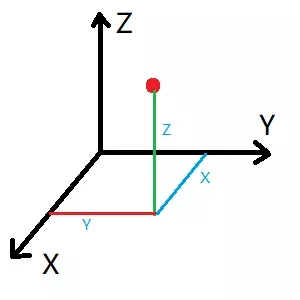

## 坐标系

&emsp;&emsp;Cesium 中常用的坐标系有两大类，WGS84 地理坐标系和笛卡尔空间坐标系。

&emsp;&emsp;WGS84 地理坐标系包括 WGS84 经纬度坐标系(没有实际的对象)和 WGS84 弧度坐标系(Cartographic)。

&emsp;&emsp;笛卡尔空间坐标系包括平面坐标系(Cartesian2)、笛卡尔空间直角坐标系(Cartesian3)、4D 笛卡尔坐标系(Cartesian4)。

### WGS84 坐标系

&emsp;&emsp;全称为世界大地测量系统(World Geodetic System)是一种用于地图学、大地测量学和导航(包括全球定位系统)的大地测量系统标准。WGS 包含了一套地球的标准经纬坐标系、一个用于计算原始海拔数据的参考椭球体，和一套用以定义海平面高度的引力等势面数据。


&emsp;&emsp;WGS84 坐标是一种地心坐标系，坐标原点为地球质心，其地心空间直角坐标系的 Z 轴指向 BIH（国际时间服务机构）1984.0 定义的协议地球级(CTP)反向，X 轴指向 BIM 1984.0 的零子午面和 CTP 赤道的交点，Y 轴与 Z 轴、X 轴垂直构成右手坐标系。平常手机指南针显示的经纬度就是这个坐标系下的当前坐标。经度范围[-180, 180],纬度范围[-90, 90]。它是航天与远程武器和空间科学中各种定位测控测轨的依据。


| 参数名                 | 参数值              |
| :--------------------- | :------------------ |
| 长半轴 a/m             | 6378137             |
| 短半轴 b/m             | 6356752.314         |
| 地心引力常数 GM(m3/s2) | 3.986004418 \* 1024 |
| 自转角速度             | 7.292115\*10 - 5    |
| 扁率 f                 | 1/298.257223563     |

### 笛卡尔空间坐标系

### 平面坐标系(Cartesian2)

&emsp;&emsp;也就是平面直角坐标系，是一个二维笛卡尔坐标系，与 Cartesian3 相比少了一个 z 的分量。Cartesian2 经常用来描述屏幕坐标系，比如鼠标在电脑屏幕上的点击位置，返回的就是 Cartesian2，返回了鼠标点击位置的 xy 像素点分量。


```js
new Cesium.Cartesian2(x, y);
```

### 笛卡尔空间直角坐标系 - 世界坐标(Cartesian3)

&emsp;&emsp;笛卡尔空间直角坐标系的原点就是椭球的中心，我们在计算机上进行绘图时，不方便使用经纬度直接进行绘图，一般会将坐标系转换为笛卡尔坐标系，使用计算机图形学中的知识进行绘图。



```js
new Cesium.Cartesian3(x, y, z);
```

### 4D 笛卡尔坐标系（Cartesian4）

## 经纬度与弧度

### 经纬度

&emsp;&emsp;坐标原点在椭球的质心。

&emsp;&emsp;经度：参考椭球面上某点的大地子午面与本初子午面间的两面角。东正西负。

&emsp;&emsp;纬度：参考椭球面上某点的法线与赤道平面的夹角。北正南负。

&emsp;&emsp;Cesium.js 中没有具体的经纬度对象，要得到经纬度首先需要计算为弧度，再进行转换。

### 弧度

&emsp;&emsp;在 Cesium 中没有实际的对象来描述 WGS84 坐标，都是以弧度的方式来进行运用的也就是 Cartographic 类。

```js
new Cesium.Cartographic(longitude, latitude, height);
```

&emsp;&emsp;&emsp;&emsp;这里的参数 longitude、latitude 是以弧度为单位。计算方法：

> 弧度 = π / 180 × 经纬度角度。

## 转换方式

### 经纬度与弧度的转换

##### 经纬度 → 弧度

```js
const radians = Cesium.Math.toRadians(degrees);
```

##### 弧度 → 经纬度

```js
const degrees = Cesium.Math.toDegrees(radians);
```

### WGS 经纬度与 WGS84 弧度坐标系(Cartographic)的转换

##### 弧度 → Cartographic

```js
const cartographic = Cesium.Cartographic.fromRadians(
  longitude,
  latitude,
  height
); // longitude和latitude为弧度
```

##### 角度 → Cartographic

- 方法 1：角度先转弧度，再转 Cartographic

```js
const longitude = Cesium.Math.toRadians(lng); // lng为角度
const latitude = Cesium.Math.toRadians(lat); // lat为角度
const cartographic = new Cesium.Cartographic(longitude, latitude, height)；
```

- 方法 2

```js
const cartographic = Cesium.Cartographic.fromDegrees(
  longitude,
  latitude,
  height
); // longitude, latitude均为角度
```

### WGS84 坐标系与笛卡尔空间直角坐标系(Cartesian3)的转换

##### 弧度 → Cartesian3

```js
// longitude, latitude均以弧度为单位。
Cesium.Cartesian3.fromRadians(longitude, latitude, height);
Cesium.Cartesian3.fromRadiansArray(coordinates);
Cesium.Cartesian3.fromRadiansArrayHeights(coordinates);
```

##### 角度 → Cartesian3

```js
// longitude, latitude均以度为单位。
const position = Cesium.Cartesian3.fromDegrees(longitude, latitude, height);

//coordinates格式为不带高度的数组。例如：[-115.0, 37.0, -107.0, 33.0]
const positions = Cesium.Cartesian3.fromDegreesArray(coordinates);

//coordinates格式为带有高度的数组。例如：[-115.0, 37.0, 100000.0, -107.0, 33.0, 150000.0]
const positions = Cesium.Cartesian3.fromDegreesArrayHeights(coordinates);
```

&emsp;&emsp;同上述，还可以通过弧度转换，再使用 Cesium.Cartesian3.fromRadians，Cesium.Cartesian3.fromRadiansArray，Cesium.Cartesian3.fromRadiansArrayHeights 等方法;

##### Cartographic → Cartesian3

- 方法 1：

```js
Cesium.Cartographic.toCartesian(cartographic, ellipsoid, result);
```

- 方法 2：

```js
viewer.scene.globe.ellipsoid.cartographicToCartesian(cartographic);
```

##### Cartesian3 → Cartographic

- 方法 1：

```js
const cartographic = Cesium.Cartographic.fromCartesian(
  cartesian,
  ellipsoid,
  result
);
```

- 方法 2：

```js
const cartographic = Cesium.Ellipsoid.WGS84.cartesianToCartographic(cartesian3);
const cartographics = Cesium.Ellipsoid.WGS84.cartesianArrayToCartographicArray([cartesian1, cartesian2, cartesian3])；
```

### 平面坐标系(Cartesian2)和笛卡尔空间直角坐标系(Cartesian3)的转换

##### Cartesian2 → Cartesian3

&emsp;&emsp;当前的点必须在三维球上，否则返回的是 undefined。通过 ScreenSpaceEventHandler 回调会取到的坐标都是 Cartesian2。

1. 屏幕坐标转场景 WGS84 坐标，这里的场景坐标是包含了地形、倾斜、模型的坐标。

```js
const cartesian3 = viewer.scene.pickPosition(windowPosition, result);
```

2. 屏幕坐标转地表坐标，这里是地球表面的 WGS84 坐标，包含地形，不包括模型、倾斜摄影表面。

```js
const cartesian3 = viewer.scene.globe.pick(
  viewer.camera.getPickRay(Cartesian2),
  viewer.scene
);
```

3. 屏幕坐标转椭球面坐标，这里的椭球面坐标是参考椭球的 WGS84 坐标，不包含地形、模型、倾斜摄影表面。

```js
const cartesian3 = viewer.scene.camera.pickEllipsoid(Cartesian2);
```

##### Cartesian3 → Cartesian2

- 方法 1:

```js
const cartesian2 = Cesium.Cartesian2.fromCartesian3(cartesian3, result);
```

- 方法 2:

```js
const cartesian2 = Cesium.SceneTransforms.wgs84ToWindowCoordinates(
  viewer.scene,
  cartesian3
);
```
