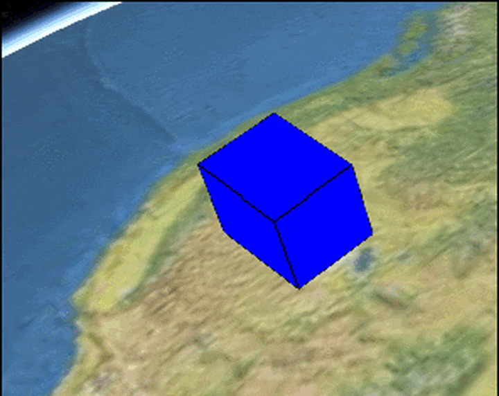
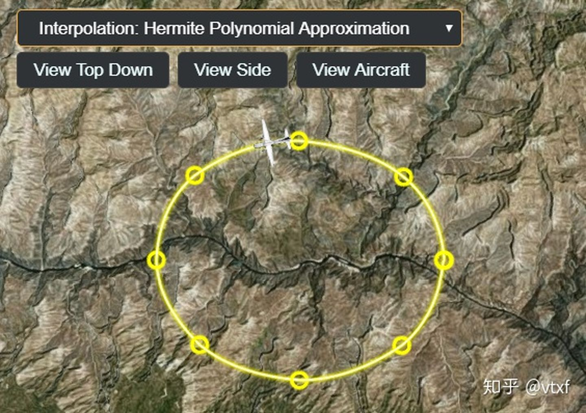

### SampledPeoperty

&emsp;&emsp;用来通过给定多个不同时间的 Sample，在每两个时间点之间进行线性插值的一种 Property。

```js
const viewer = new Cesium.Viewer("cesiumContainer");

const blueBox = viewer.entities.add({
  name: "Blue box",
  position: Cesium.Cartesian3.fromDegrees(-114.0, 40.0, 300000.0),
  box: {
    dimensions: new Cesium.Cartesian3(400000.0, 300000.0, 500000.0),
    material: Cesium.Color.BLUE,
    outline: true,
  },
});

const property = new Cesium.SampledProperty(Cesium.Cartesian3);
property.addSample(
  Cesium.JulianDate.fromIso8601("2021-06-24T06:16:00.00Z"),
  new Cesium.Cartesian3(400000.0, 300000.0, 100000.0)
);

property.addSample(
  Cesium.JulianDate.fromIso8601("2021-06-24T06:16:05.00Z"),
  new Cesium.Cartesian3(400000.0, 300000.0, 900000.0)
);

blueBox.box.dimensions = property;

viewer.zoomTo(viewer.entities);
```



### SampledPostionProperty

```js
const blueBox = viewer.entities.add({
  name: "Blue box",
  position: Cesium.Cartesian3.fromDegrees(-114.0, 40.0, 300000.0),
  box: {
    dimensions: new Cesium.Cartesian3(400000.0, 300000.0, 500000.0),
    material: Cesium.Color.BLUE,
    outline: true,
  },
});

const property = new Cesium.SampledPositionProperty();

property.addSample(
  Cesium.JulianDate.fromIso8601("2021-06-24T06:26:00.00Z"),
  Cesium.Cartesian3.fromDegrees(-114.0, 40.0, 300000.0)
);

property.addSample(
  Cesium.JulianDate.fromIso8601("2021-06-24T06:26:05.00Z"),
  Cesium.Cartesian3.fromDegrees(-114.0, 45.0, 300000.0)
);

blueBox.position = property;
```


## setInterpolationOptions 方法

&emsp;&emsp;SampleProperty 和 SampledPositionProperty 有一个特有的方法：setInterpolationOptions(options)，用来修改不同的插值方式。

### 线性插值：Cesium.LinearApproximation

```js
entity.position.setInterpolationOptions({
  interpolationDegree: 1,
  interpolationAlgorithm: Cesium.LinearApproximation,
});
```


### Lagrange 插值：Cesium.LagrangePolynomialApproximation

```js
entity.position.setInterpolationOptions({
  interpolationDegree: 5,
  interpolationAlgorithm: Cesium.LagrangePolynomialApproximation,
});
```


### Hermite 插值：Cesium.LinearApproximation

```js
entity.position.setInterpolationOptions({
  interpolationDegree: 1,
  interpolationAlgorithm: Cesium.HermitePolynomialApproximation,
});
```


