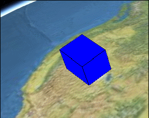

&emsp;&emsp;CompositeProperty 的意思是组合的 Property，可以把多种不同类型的 ConstantsPropery、SampledProperty、imeIntervalCollectionProperty 组合在一起来操作。比如：前一时间段需要线性运动，后一时间段再跳跃式运动：

```js
// 1 sampledProperty
const sampledProperty = new Cesium.SampledProperty(Cesium.Cartesian3);
sampledProperty.addSample(
  Cesium.JulianDate.fromIso8601("2021-06-24T00:00:00.00Z"),
  new Cesium.Cartesian3(400000.0, 300000.0, 200000.0)
);

sampledProperty.addSample(
  Cesium.JulianDate.fromIso8601("2021-06-25T00:00:00.00Z"),
  new Cesium.Cartesian3(400000.0, 300000.0, 400000.0)
);

// 2 ticProperty
const ticProperty = new Cesium.TimeIntervalCollectionProperty();
ticProperty.intervals.addInterval(
  Cesium.TimeInterval.fromIso8601({
    iso8601: "2021-06-25T00:00:00.00Z/2021-06-25T06:00:00.00Z",
    isStartIncluded: true,
    isStopIncluded: false,
    data: new Cesium.Cartesian3(400000.0, 300000.0, 400000.0),
  })
);
ticProperty.intervals.addInterval(
  Cesium.TimeInterval.fromIso8601({
    iso8601: "2021-06-25T06:00:00.00Z/2021-06-25T12:00:00.00Z",
    isStartIncluded: true,
    isStopIncluded: false,
    data: new Cesium.Cartesian3(400000.0, 300000.0, 500000.0),
  })
);
ticProperty.intervals.addInterval(
  Cesium.TimeInterval.fromIso8601({
    iso8601: "2021-06-25T12:00:00.00Z/2021-06-25T18:00:00.00Z",
    isStartIncluded: true,
    isStopIncluded: false,
    data: new Cesium.Cartesian3(400000.0, 300000.0, 600000.0),
  })
);
ticProperty.intervals.addInterval(
  Cesium.TimeInterval.fromIso8601({
    iso8601: "2021-06-25T18:00:00.00Z/2019-01-03T23:00:00.00Z",
    isStartIncluded: true,
    isStopIncluded: true,
    data: new Cesium.Cartesian3(400000.0, 300000.0, 700000.0),
  })
);

// 3 compositeProperty
const compositeProperty = new Cesium.CompositeProperty();
compositeProperty.intervals.addInterval(
  Cesium.TimeInterval.fromIso8601({
    iso8601: "2021-06-24T00:00:00.00Z/2021-06-25T00:00:00.00Z",
    data: sampledProperty,
  })
);
compositeProperty.intervals.addInterval(
  Cesium.TimeInterval.fromIso8601({
    iso8601: "2021-06-25T00:00:00.00Z/2019-01-03T00:00:00.00Z",
    isStartIncluded: false,
    isStopIncluded: false,
    data: ticProperty,
  })
);
```


