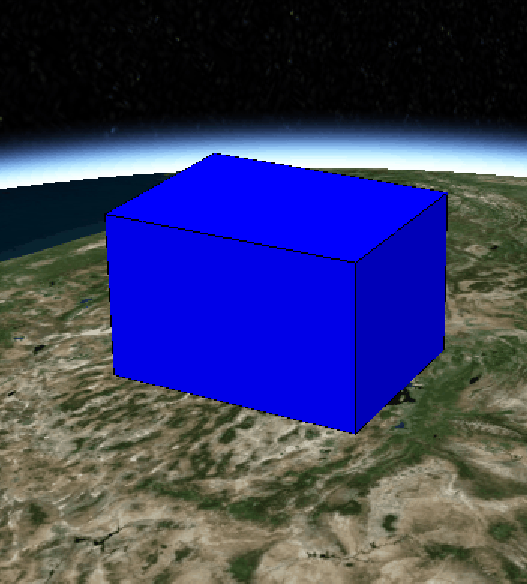

## CallbackProperty

&emsp;&emsp;CallbackProperty 是自由度最高的一种 Property,该属性的值由回调函数延迟计算。

&emsp;&emsp;当数据无法预先计算或需要在运行时从其他属性派生时，请使用 CallbackProperty。

```js
const viewer = new Cesium.Viewer("cesiumContainer");
const blueBox = viewer.entities.add({
  name: "Blue box",
  position: Cesium.Cartesian3.fromDegrees(-114.0, 40.0, 200000.0),
  box: {
    dimensions: new Cesium.Cartesian3(400000.0, 300000.0, 200000.0),
    material: Cesium.Color.BLUE,
    outline: true,
  },
});

let height = 200000.0;

const property = new Cesium.CallbackProperty(
  (time, result = new Cesium.Cartesian3(0, 0, 0)) => {
    height += 1000.0;
    if (height > 700000.0) {
      height = 200000.0;
    }

    result.x = 400000.0;
    result.y = 300000.0;
    result.z = height;

    return result;
  }
);

blueBox.box.dimensions = property;
viewer.zoomTo(viewer.entities);
```



[Sandcastle CallbackProperty](https://sandcastle.cesium.com/?src=Callback%20Property.html)
