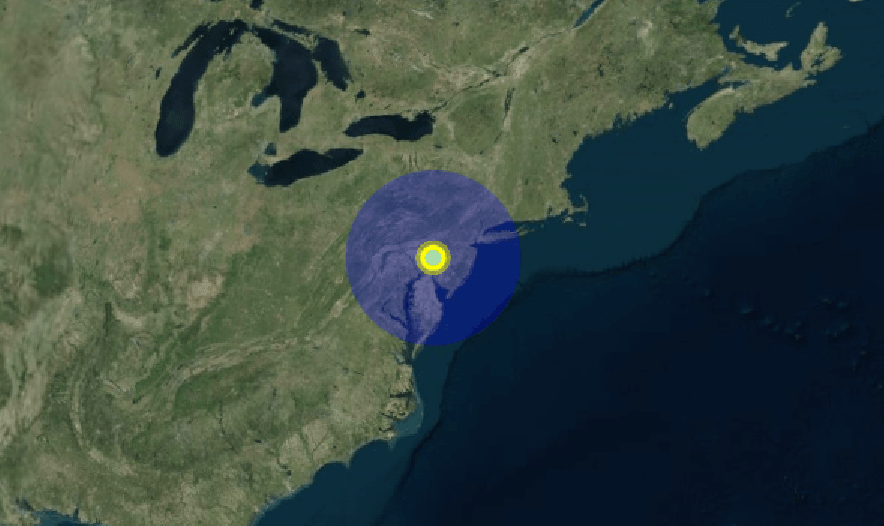

&emsp;&emsp;[PointGraphics](https://staven630.github.io/cesium-doc-zh/PointGraphics.html)用来绘制点。

| 名称                     | 类型                                                                                                                                                                       | 是否必填 | 默认值               | 描述                                                    |
| :----------------------- | :------------------------------------------------------------------------------------------------------------------------------------------------------------------------- | :------- | :------------------- | ------------------------------------------------------- |
| show                     | [Property](https://staven630.github.io/cesium-doc-zh/Property.html) \| boolean                                                                                             | <可选>   | true                 | 一个布尔属性，指定点的可见性。                          |
| pixelSize                | [Property](https://staven630.github.io/cesium-doc-zh/Property.html) \| number                                                                                              | <可选>   | 1                    | 以像素为单位指定大小的数字属性。                        |
| heightReference          | [Property](https://staven630.github.io/cesium-doc-zh/Property.html) \| [HeightReference](https://staven630.github.io/cesium-doc-zh/global.html#HeightReference)            | <可选>   | HeightReference.NONE | 一个属性，指定高度相对于什么。                          |
| color                    | [Property](https://staven630.github.io/cesium-doc-zh/Property.html) \| [Color](https://staven630.github.io/cesium-doc-zh/Color.html)                                       | <可选>   | Color.WHITE          | 指定 Color 点的属性。                                   |
| outlineColor             | [Property](https://staven630.github.io/cesium-doc-zh/Property.html) \| [Color](https://staven630.github.io/cesium-doc-zh/Color.html)                                       | <可选>   | Color.BLACK          | 指定 Color 轮廓的属性。                                 |
| outlineWidth             | [Property](https://staven630.github.io/cesium-doc-zh/Property.html) \| number                                                                                              | <可选>   | 0                    | 一个数字属性，以像素为单位指定轮廓宽度。                |
| scaleByDistance          | [Property](https://staven630.github.io/cesium-doc-zh/Property.html) \| [NearFarScalar](https://staven630.github.io/cesium-doc-zh/NearFarScalar.html)                       | <可选>   |                      | 一个 NearFarScalar 属性用于扩展基于距离的点。           |
| translucencyByDistance   | [Property](https://staven630.github.io/cesium-doc-zh/Property.html) \| [NearFarScalar](https://staven630.github.io/cesium-doc-zh/NearFarScalar.html)                       | <可选>   |                      | 一个 NearFarScalar 属性用来设置半透明基于从相机的距离。 |
| distanceDisplayCondition | [Property](https://staven630.github.io/cesium-doc-zh/Property.html) \| [DistanceDisplayCondition](https://staven630.github.io/cesium-doc-zh/DistanceDisplayCondition.html) | <可选>   |                      | 一个属性，指定该点将在距相机多远的距离处显示。          |
| disableDepthTestDistance | [Property](https://staven630.github.io/cesium-doc-zh/Property.html) \| number                                                                                              | <可选>   |                      | 一个属性，指定要禁用深度测试的距离相机的距离。          |

```js
viewer.entities.add({
  // 此点的Cartesian3位置
  position: Cesium.Cartesian3.fromDegrees(-75.59777, 40.03883),
  point: {
    // 确定是否显示该点
    show: true,

    // 获取或设置点的内部大小(以像素为单位)
    pixelSize: 10,

    // 选择点的ID
    id: "1",

    // 相对于地形的位置
    heightReference: Cesium.HeightReference.RELATIVE_TO_GROUND,

    // 获取或设置点的内部颜色
    color: Cesium.Color.YELLOW,

     // 获取或设置点的轮廓颜色
    outlineColor: Cesium.Color.BLUE,

     // 获取或设置以像素为单位的轮廓宽度
    outlineWidth: 20,

    // 获取或设置基于点与摄影机的距离的点的近缩放和远缩放属性。
    // 当相机距离pointPrimitive 1500米时，将pointPrimitive的scaleByDistance设置为缩放为15，当相机距离接近8.0e6米时消失。
    scaleByDistance: new Cesium.NearFarScalar(1.5e2, 15, 8.0e6, 0.0),

    // 基于点与摄影机的距离获取或设置点的近半透明和远半透明属性。
    // 当相机距点1500米时，将点的半透明度设置为1.0，当相机距离接近8.0e6米时，半透明度消失。
    translucencyByDistance: new Cesium.NearFarScalar(1.5e2, 1.0, 8.0e6, 0.0),

    // 指定该点将在距相机多远的距离处显示
    // 只有当距离相机在10到20米之间时才可见。
    distanceDisplayCondition:new Cesium.DistanceDisplayCondition(10.0, 20.0);

    // 指定要禁用深度测试的距离相机的距离。
    disableDepthTestDistance: false
  },
});
```



&emsp;&emsp;可以动态改变 Point 的属性：

```js
const entity = viewer.entities.add({
  position: Cesium.Cartesian3.fromDegrees(-75.59777, 40.03883, 300000.0),
  point: {
    pixelSize: 2,
  },
});

const point = entity.point;
point.pixelSize = 20.0;
point.color = Cesium.Color.YELLOW.withAlpha(0.33);
```

[Sandcastle Points](https://sandcastle.cesium.com/index.html?src=Points.html)
