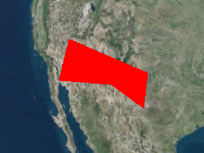
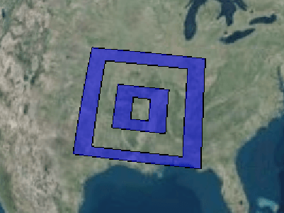
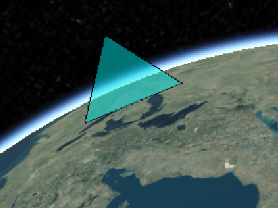
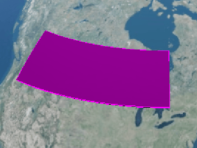

## [PolygonGraphics](https://staven630.github.io/cesium-doc-zh/PolygonGraphics.html)

| 名称                     | 类型                                                                                                                                                                       | 是否必填 | 默认值                         | 描述                                                                                       |
| :----------------------- | :------------------------------------------------------------------------------------------------------------------------------------------------------------------------- | :------- | :----------------------------- | :----------------------------------------------------------------------------------------- |
| show                     | [Property](https://staven630.github.io/cesium-doc-zh/Property.html) \| boolean                                                                                             | <可选>   | true                           | 用于指定多边形的可见性                                                                     |
| hierarchy                | [Property](https://staven630.github.io/cesium-doc-zh/Property.html) \| [PolygonHierarchy](https://staven630.github.io/cesium-doc-zh/PolygonHierarchy.html)                 | <可选>   |                                | 该属性指定 PolygonHierarchy。                                                              |
| height                   | [Property](https://staven630.github.io/cesium-doc-zh/Property.html) \| number                                                                                              | <可选>   | 0                              | 用于指定多边形相对于椭球面的高度。                                                         |
| heightReference          | [Property](https://staven630.github.io/cesium-doc-zh/Property.html) \| [HeightReference](https://staven630.github.io/cesium-doc-zh/global.html#HeightReference)            | <可选>   | HeightReference.NONE           | 指定高度相对于什么的属性。                                                                 |
| extrudedHeight           | [Property](https://staven630.github.io/cesium-doc-zh/Property.html) \| number                                                                                              | <可选>   |                                | 用于指定多边形的凸出面相对于椭球面的高度。                                                 |
| extrudedHeightReference  | [Property](https://staven630.github.io/cesium-doc-zh/Property.html) \| [HeightReference](https://staven630.github.io/cesium-doc-zh/global.html#HeightReference)            | <可选>   | HeightReference.NONE           | 指定了 extrudedHeight 相对于什么。                                                         |
| stRotation               | [Property](https://staven630.github.io/cesium-doc-zh/Property.html) \| number                                                                                              | <可选>   | 0.0                            | 用于指定多边形纹理从北方逆时针旋转。                                                       |
| granularity              | [Property](https://staven630.github.io/cesium-doc-zh/Property.html) \| number                                                                                              | <可选>   | Cesium.Math.RADIANS_PER_DEGREE | 指定每个纬度和经度点之间的角距离。                                                         |
| fill                     | [Property](https://staven630.github.io/cesium-doc-zh/Property.html) \| boolean                                                                                             | <可选>   | true                           | 用于指定多边形是否被所提供的材料填充。                                                     |
| material                 | [MaterialProperty](https://staven630.github.io/cesium-doc-zh/MaterialProperty.html) \| [Color](https://staven630.github.io/cesium-doc-zh/Color.html)                       | <可选>   | Color.WHITE                    | 用于指定用于填充多边形的材料。                                                             |
| outline                  | [Property](https://staven630.github.io/cesium-doc-zh/Property.html) \| boolean                                                                                             | <可选>   | false                          | 用于指定是否勾勒出多边形。                                                                 |
| outlineColor             | [Property](https://staven630.github.io/cesium-doc-zh/Property.html) \| [Color](https://staven630.github.io/cesium-doc-zh/Color.html)                                       | <可选>   | Color.BLACK                    | 指定 Color 轮廓的属性。                                                                    |
| outlineWidth             | [Property](https://staven630.github.io/cesium-doc-zh/Property.html) \| number                                                                                              | <可选>   | 1.0                            | 指定轮廓宽度的数字属性。                                                                   |
| perPositionHeight        | [Property](https://staven630.github.io/cesium-doc-zh/Property.html) \| boolean                                                                                             | <可选>   | false                          | 指定是否使用每个位置的高度。                                                               |
| closeTop                 | Boolean \| boolean                                                                                                                                                         | <可选>   | true                           | 如果为 false，则将挤出的多边形顶部留空。                                                   |
| closeBottom              | Boolean \| boolean                                                                                                                                                         | <可选>   | true                           | 如果为 false，则将挤出的多边形的底部保留为开放状态。                                       |
| arcType                  | [Property](https://staven630.github.io/cesium-doc-zh/Property.html) \| [ArcType](https://staven630.github.io/cesium-doc-zh/global.html#ArcType)                            | <可选>   | ArcType.GEODESIC               | 多边形边缘必须遵循的线型。                                                                 |
| shadows                  | [Property](https://staven630.github.io/cesium-doc-zh/Property.html) \| [ShadowMode](https://staven630.github.io/cesium-doc-zh/global.html#ShadowMode)                      | <可选>   | ShadowMode.DISABLED            | 用于指定该多边形是投射还是接收来自光源的阴影。                                             |
| distanceDisplayCondition | [Property](https://staven630.github.io/cesium-doc-zh/Property.html) \| [DistanceDisplayCondition](https://staven630.github.io/cesium-doc-zh/DistanceDisplayCondition.html) | <可选>   |                                | 用于指定要在距相机的距离处显示此多边形。                                                   |
| classificationType       | [Property](https://staven630.github.io/cesium-doc-zh/Property.html) \| [ClassificationType](https://staven630.github.io/cesium-doc-zh/global.html#ClassificationType)      | <可选>   | ClassificationType.BOTH        | 用于指定此多边形在地面上时是对地形，3D 瓷砖还是对两者进行分类。                            |
| zIndex                   | [ConstantProperty](https://staven630.github.io/cesium-doc-zh/ConstantProperty.html) \| number                                                                              | <可选>   | 0                              | 指定用于排序地面几何图形的 zIndex 的属性。仅当多边形为常量且未指定高度或拉伸高度时才有效。 |

```js
viewer.entities.add({
  polygon: {
    hierarchy: Cesium.Cartesian3.fromDegreesArray([
      -115.0,
      37.0,
      -115.0,
      32.0,
      -107.0,
      33.0,
      -102.0,
      31.0,
      -102.0,
      35.0,
    ]),
    material: Cesium.Color.RED,
  },
});
```



```js
viewer.entities.add({
  polygon: {
    hierarchy: Cesium.Cartesian3.fromDegreesArray([
      -108.0,
      42.0,
      -100.0,
      42.0,
      -104.0,
      40.0,
    ]),
    extrudedHeight: 500000.0,
    material: Cesium.Color.GREEN,
    closeTop: false,
    closeBottom: true,
  },
});
```


```js
viewer.entities.add({
  polygon: {
    hierarchy: Cesium.Cartesian3.fromDegreesArrayHeights([
      -108.0,
      25.0,
      100000,
      -100.0,
      25.0,
      100000,
      -100.0,
      30.0,
      100000,
      -108.0,
      30.0,
      300000,
    ]),
    extrudedHeight: 0,
    perPositionHeight: true,
    material: Cesium.Color.ORANGE.withAlpha(0.5),
    outline: true,
    outlineColor: Cesium.Color.BLACK,
  },
});
```


```js
viewer.entities.add({
  polygon: {
    hierarchy: {
      positions: Cesium.Cartesian3.fromDegreesArray([
        -99.0,
        30.0,
        -85.0,
        30.0,
        -85.0,
        40.0,
        -99.0,
        40.0,
      ]),
      holes: [
        {
          positions: Cesium.Cartesian3.fromDegreesArray([
            -97.0,
            31.0,
            -97.0,
            39.0,
            -87.0,
            39.0,
            -87.0,
            31.0,
          ]),
          holes: [
            {
              positions: Cesium.Cartesian3.fromDegreesArray([
                -95.0,
                33.0,
                -89.0,
                33.0,
                -89.0,
                37.0,
                -95.0,
                37.0,
              ]),
              holes: [
                {
                  positions: Cesium.Cartesian3.fromDegreesArray([
                    -93.0,
                    34.0,
                    -91.0,
                    34.0,
                    -91.0,
                    36.0,
                    -93.0,
                    36.0,
                  ]),
                },
              ],
            },
          ],
        },
      ],
    },
    material: Cesium.Color.BLUE.withAlpha(0.5),
    height: 0,
    outline: true,
  },
});
```



```js
viewer.entities.add({
  polygon: {
    hierarchy: Cesium.Cartesian3.fromDegreesArrayHeights([
      -90.0,
      41.0,
      0.0,
      -85.0,
      41.0,
      500000.0,
      -80.0,
      41.0,
      0.0,
    ]),
    perPositionHeight: true,
    material: Cesium.Color.CYAN.withAlpha(0.5),
    outline: true,
    outlineColor: Cesium.Color.BLACK,
  },
});
```



```js
viewer.entities.add({
  polygon: {
    hierarchy: Cesium.Cartesian3.fromDegreesArray([
      -120.0,
      45.0,
      -80.0,
      45.0,
      -80.0,
      55.0,
      -120.0,
      55.0,
    ]),
    extrudedHeight: 50000,
    material: Cesium.Color.PURPLE,
    outline: true,
    outlineColor: Cesium.Color.MAGENTA,
    arcType: Cesium.ArcType.RHUMB,
  },
});
```



## 示例

- [Cesium Sandcastle Polygon Demo](https://sandcastle.cesium.com/index.html?src=Polygon.html)
