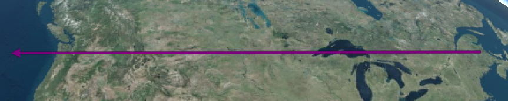
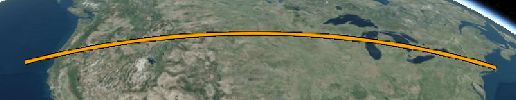
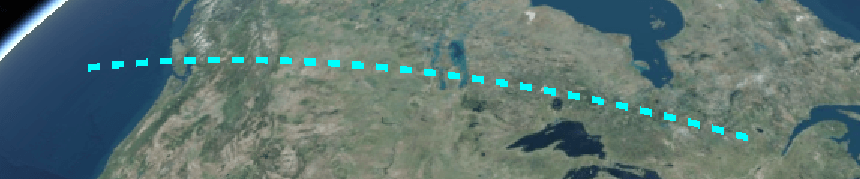

## [Polyline](https://staven630.github.io/cesium-doc-zh/Polyline.html)

| 名称                     | 类型                                                                                                | 是否必填 | 默认值             | 描述                                             |
| :----------------------- | :-------------------------------------------------------------------------------------------------- | :------- | :----------------- | :----------------------------------------------- |
| show                     | Boolean                                                                                             | 可选     | true               | 如果显示此折线，设为 true，否则设为 false。      |
| width                    | Number                                                                                              | 可选     | 1.0                | 这显得宽度(以像素为单位)                         |
| loop                     | Boolean                                                                                             | 可选     | false              | 是否在第一个和最后一个折线间添加线段成为闭环线段 |
| material                 | [Material](https://staven630.github.io/cesium-doc-zh/Material.html)                                 | 可选     | Material.ColorType | 材料                                             |
| positions                | Array.\<[Cartesian3](https://staven630.github.io/cesium-doc-zh/Cartesian3.html)>                    | 可选     |                    | 位置                                             |
| id                       | Object                                                                                              | 可选     |                    | 唯一标识符                                       |
| distanceDisplayCondition | [DistanceDisplayCondition](https://staven630.github.io/cesium-doc-zh/DistanceDisplayCondition.html) | 可选     |                    | 指定在距相机多远处显示此折线的条件               |

```js
const redLine = viewer.entities.add({
  name: "RedLine",
  polyline: {
    positions: Cesium.Cartesian3.fromDegreesArray([-75, 35, -125, 35]),
    width: 5,
    material: Cesium.Color.RED,
    clampToGround: true,
  },
});

const greenRhumbLine = viewer.entities.add({
  name: "GreenLine",
  polyline: {
    positions: Cesium.Cartesian3.fromDegreesArray([-75, 35, -125, 35]),
    width: 5,
    arcType: Cesium.ArcType.RHUMB,
    material: Cesium.Color.GREEN,
  },
});

const orangeOutlined = viewer.entities.add({
  name: "OrangeLine",
  polyline: {
    positions: Cesium.Cartesian3.fromDegreesArrayHeights([
      -75,
      39,
      250000,
      -125,
      39,
      250000,
    ]),
    width: 5,
    material: new Cesium.PolylineOutlineMaterialProperty({
      color: Cesium.Color.ORANGE,
      outlineWidth: 2,
      outlineColor: Cesium.Color.BLACK,
    }),
  },
});

const purpleArrow = viewer.entities.add({
  name: "PurpleArrow",
  polyline: {
    positions: Cesium.Cartesian3.fromDegreesArrayHeights([
      -75,
      43,
      500000,
      -125,
      43,
      500000,
    ]),
    width: 10,
    arcType: Cesium.ArcType.NONE,
    material: new Cesium.PolylineArrowMaterialProperty(Cesium.Color.PURPLE),
  },
});

const dashedLine = viewer.entities.add({
  name: "DashedLine",
  polyline: {
    positions: Cesium.Cartesian3.fromDegreesArrayHeights([
      -75,
      45,
      500000,
      -125,
      45,
      500000,
    ]),
    width: 4,
    material: new Cesium.PolylineDashMaterialProperty({
      color: Cesium.Color.CYAN,
    }),
  },
});

viewer.zoomTo(viewer.entities);
```

## [PolylineGraphics](https://staven630.github.io/cesium-doc-zh/PolylineGraphics.html)

| 名称                     | 类型                                                                                                                                                                       | 是否必填 | 默认值                         | 描述                                                                                                  |
| :----------------------- | :------------------------------------------------------------------------------------------------------------------------------------------------------------------------- | :------- | :----------------------------- | :---------------------------------------------------------------------------------------------------- |
| show                     | [Property](https://staven630.github.io/cesium-doc-zh/Property.html) \| boolean                                                                                             | <可选>   | true                           | 指定折线可见性的布尔属性。                                                                            |
| positions                | [Property](https://staven630.github.io/cesium-doc-zh/Property.html) \| [Cartesian3](https://staven630.github.io/cesium-doc-zh/Cartesian3.html)                             | <可选>   |                                | 它指定定义线带的 Cartesian3 位置的数组。                                                              |
| width                    | [Property](https://staven630.github.io/cesium-doc-zh/Property.html) \| number                                                                                              | <可选>   | 1.0                            | 以像素为单位指定宽度的数字属性。                                                                      |
| granularity              | [Property](https://staven630.github.io/cesium-doc-zh/Property.html) \| number                                                                                              | <可选>   | Cesium.Math.RADIANS_PER_DEGREE | 如果 arcType 不是 ArcType.NONE，则指定每个纬度和经度之间的角距离的数字属性。                          |
| material                 | [MaterialProperty](https://staven630.github.io/cesium-doc-zh/MaterialProperty.html) \| [Color](https://staven630.github.io/cesium-doc-zh/Color.html)                       | <可选>   | Color.WHITE                    | 指定用于绘制折线的材料。                                                                              |
| depthFailMaterial        | [MaterialProperty](https://staven630.github.io/cesium-doc-zh/MaterialProperty.html) \| [Color](https://staven630.github.io/cesium-doc-zh/Color.html)                       | <可选>   |                                | 用于指定折线低于地形时用于绘制折线的材料。                                                            |
| arcType                  | [Property](https://staven630.github.io/cesium-doc-zh/Property.html) \| [ArcType](https://staven630.github.io/cesium-doc-zh/global.html#ArcType)                            | <可选>   | ArcType.GEODESIC               | 折线段必须遵循的线类型。                                                                              |
| clampToGround            | [Property](https://staven630.github.io/cesium-doc-zh/Property.html) \| boolean                                                                                             | <可选>   | false                          | 指定是否应将折线固定在地面上。                                                                        |
| shadows                  | [Property](https://staven630.github.io/cesium-doc-zh/Property.html) \| [ShadowMode](https://staven630.github.io/cesium-doc-zh/global.html#ShadowMode)                      | <可选>   | ShadowMode.DISABLED            | 指定折线是投射还是接收来自光源的阴影。                                                                |
| distanceDisplayCondition | [Property](https://staven630.github.io/cesium-doc-zh/Property.html) \| [DistanceDisplayCondition](https://staven630.github.io/cesium-doc-zh/DistanceDisplayCondition.html) | <可选>   |                                | 指定将在距相机多远的地方显示此折线。                                                                  |
| classificationType       | [Property](https://staven630.github.io/cesium-doc-zh/Property.html) \| [ClassificationType](https://staven630.github.io/cesium-doc-zh/global.html#ClassificationType)      | <可选>   | ClassificationType.BOTH        | 指定此折线在地面上时是否对地形、3D 瓷砖或两者进行分类。                                               |
| zIndex                   | [Property](https://staven630.github.io/cesium-doc-zh/Property.html) \| number                                                                                              | <可选>   | 0                              | 指定用于排序地面几何图形的 zIndex 的属性。仅当 `clampToGround` 为 true 并且支持地形上的折线时才有效。 |

## [PolylineGlowMaterialProperty](https://staven630.github.io/cesium-doc-zh/PolylineGlowMaterialProperty.html)

| 名称       | 类型                                                                                                                                 | 是否必填 | 默认值      | 描述                                                                              |
| :--------- | :----------------------------------------------------------------------------------------------------------------------------------- | :------- | :---------- | :-------------------------------------------------------------------------------- |
| color      | [Property](https://staven630.github.io/cesium-doc-zh/Property.html) \| [Color](https://staven630.github.io/cesium-doc-zh/Color.html) | 可选     | Color.WHITE | 用于线的 Color 属性。                                                             |
| glowPower  | [Property](https://staven630.github.io/cesium-doc-zh/Property.html) \| Number                                                        | 可选     | 0.25        | 指定发光强度，作为总线宽的百分比                                                  |
| taperPower | [Property](https://staven630.github.io/cesium-doc-zh/Property.html) \| Number                                                        | 可选     | 1.0         | 指定锥形效果的强度，以总线条长度的百分比表示。如果 1.0 或更高，则不使用锥形效果。 |

```js
const glowingLine = viewer.entities.add({
  name: "GlowingLine",
  polyline: {
    positions: Cesium.Cartesian3.fromDegreesArray([-75, 37, -125, 37]),
    width: 10,
    material: new Cesium.PolylineGlowMaterialProperty({
      glowPower: 0.2,
      taperPower: 0.5,
      color: Cesium.Color.CORNFLOWERBLUE,
    }),
  },
});
```


## [PolylineArrowMaterialProperty](https://staven630.github.io/cesium-doc-zh/PolylineArrowMaterialProperty.html)

| 名称  | 类型                                                                                                                                 | 是否必填 | 默认值      | 描述                  |
| :---- | :----------------------------------------------------------------------------------------------------------------------------------- | :------- | :---------- | :-------------------- |
| color | [Property](https://staven630.github.io/cesium-doc-zh/Property.html) \| [Color](https://staven630.github.io/cesium-doc-zh/Color.html) | 可选     | Color.WHITE | 用于线的 Color 属性。 |

```js
const purpleArrow = viewer.entities.add({
  name: "PurpleArrow",
  polyline: {
    positions: Cesium.Cartesian3.fromDegreesArrayHeights([
      -75,
      43,
      500000,
      -125,
      43,
      500000,
    ]),
    width: 10,
    arcType: Cesium.ArcType.NONE,
    material: new Cesium.PolylineArrowMaterialProperty(Cesium.Color.PURPLE),
  },
});
```



## [PolylineOutlineMaterialProperty](https://staven630.github.io/cesium-doc-zh/PolylineOutlineMaterialProperty.html)

| 名称         | 类型                                                                                                                                 | 是否必填 | 默认值      | 描述                  |
| :----------- | :----------------------------------------------------------------------------------------------------------------------------------- | :------- | :---------- | :-------------------- |
| color        | [Property](https://staven630.github.io/cesium-doc-zh/Property.html) \| [Color](https://staven630.github.io/cesium-doc-zh/Color.html) | 可选     | Color.WHITE | 用于线的 Color 属性。 |
| outlineColor | [Property](https://staven630.github.io/cesium-doc-zh/Property.html) \| [Color](https://staven630.github.io/cesium-doc-zh/Color.html) | 可选     | 1.0         |                       |

```js
const orangeOutlined = viewer.entities.add({
  name: "OrangeLine",
  polyline: {
    positions: Cesium.Cartesian3.fromDegreesArrayHeights([
      -75,
      39,
      250000,
      -125,
      39,
      250000,
    ]),
    width: 5,
    material: new Cesium.PolylineOutlineMaterialProperty({
      color: Cesium.Color.ORANGE,
      outlineWidth: 2,
      outlineColor: Cesium.Color.BLACK,
    }),
  },
});
```



## [PolylineDashMaterialProperty](https://staven630.github.io/cesium-doc-zh/PolylineDashMaterialProperty.html)

| 名称        | 类型                                                                                                                                 | 是否必填 | 默认值      | 描述                             |
| :---------- | :----------------------------------------------------------------------------------------------------------------------------------- | :------- | :---------- | :------------------------------- |
| color       | [Property](https://staven630.github.io/cesium-doc-zh/Property.html) \| [Color](https://staven630.github.io/cesium-doc-zh/Color.html) | 可选     | Color.WHITE | 用于线的 Color 属性。            |
| gapColor    | [Property](https://staven630.github.io/cesium-doc-zh/Property.html) \| [Color](https://staven630.github.io/cesium-doc-zh/Color.html) | 可选     | 1.0         | 指定间隙的颜色                   |
| dashLength  | [Property](https://staven630.github.io/cesium-doc-zh/Property.html) \| Number                                                        | 可选     | 16.0        | 指定虚线图案的长度(以像素为单位) |
| dashPattern | [Property](https://staven630.github.io/cesium-doc-zh/Property.html) \| Number                                                        | 可选     | 255.0       | 用于指定破折号的 16 位模式       |



## 示例

- [Cesium Sandcastle Polyline Demo](https://sandcastle.cesium.com/index.html?src=Polyline.html)
