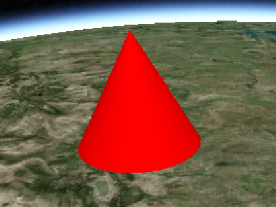

## [CylinderGraphics](https://staven630.github.io/cesium-doc-zh/CylinderGraphics.html)

| 名称                     | 类型                                                                                                                                                                       | 是否必填 | 默认值               | 描述                                     |
| :----------------------- | :------------------------------------------------------------------------------------------------------------------------------------------------------------------------- | :------- | :------------------- | :--------------------------------------- |
| show                     | [Property](https://staven630.github.io/cesium-doc-zh/Property.html) \| boolean                                                                                             | <可选>   | true                 | 指定圆柱体可见性的布尔属性。             |
| length                   | [Property](https://staven630.github.io/cesium-doc-zh/Property.html) \| number                                                                                              | <可选>   |                      | 指定圆柱体长度的数字属性。               |
| topRadius                | [Property](https://staven630.github.io/cesium-doc-zh/Property.html) \| number                                                                                              | <可选>   |                      | 指定圆柱体顶部的半径。                   |
| bottomRadius             | [Property](https://staven630.github.io/cesium-doc-zh/Property.html) \| number                                                                                              | <可选>   |                      | 指定圆柱体底部的半径。                   |
| heightReference          | [Property](https://staven630.github.io/cesium-doc-zh/Property.html) \| [HeightReference](https://staven630.github.io/cesium-doc-zh/global.html#HeightReference)            | <可选>   | HeightReference.NONE | 指定距离实体位置的高度相对于什么。       |
| fill                     | [Property](https://staven630.github.io/cesium-doc-zh/Property.html) \| boolean                                                                                             | <可选>   | true                 | 指定是否用提供的材料填充圆柱体。         |
| material                 | [MaterialProperty](https://staven630.github.io/cesium-doc-zh/MaterialProperty.html) \| [Color](https://staven630.github.io/cesium-doc-zh/Color.html)                       | <可选>   | Color.WHITE          | 指定用于填充圆柱体的材料的属性。         |
| outline                  | [Property](https://staven630.github.io/cesium-doc-zh/Property.html) \| boolean                                                                                             | <可选>   | false                | 指定圆柱体是否有轮廓。                   |
| outlineColor             | [Property](https://staven630.github.io/cesium-doc-zh/Property.html) \| [Color](https://staven630.github.io/cesium-doc-zh/Color.html)                                       | <可选>   | Color.BLACK          | 指定轮廓的 Color 属性。                  |
| outlineWidth             | [Property](https://staven630.github.io/cesium-doc-zh/Property.html) \| number                                                                                              | <可选>   | 1.0                  | 指定轮廓宽度的数字属性。                 |
| numberOfVerticalLines    | [Property](https://staven630.github.io/cesium-doc-zh/Property.html) \| number                                                                                              | <可选>   | 16                   | 用于指定沿轮廓的周长绘制的垂直线的数量。 |
| slices                   | [Property](https://staven630.github.io/cesium-doc-zh/Property.html) \| number                                                                                              | <可选>   | 128                  | 圆柱周长周围的边数。                     |
| shadows                  | [Property](https://staven630.github.io/cesium-doc-zh/Property.html) \| [ShadowMode](https://staven630.github.io/cesium-doc-zh/global.html#ShadowMode)                      | <可选>   | ShadowMode.DISABLED  | 指定圆柱体是投射还是接收来自光源的阴影。 |
| distanceDisplayCondition | [Property](https://staven630.github.io/cesium-doc-zh/Property.html) \| [DistanceDisplayCondition](https://staven630.github.io/cesium-doc-zh/DistanceDisplayCondition.html) | <可选>   |                      | 指定该圆柱体将在距相机多远的距离处显示。 |

```js
viewer.entities.add({
  position: Cesium.Cartesian3.fromDegrees(-100.0, 40.0, 200000.0),
  cylinder: {
    length: 400000.0,
    topRadius: 200000.0,
    bottomRadius: 200000.0,
    material: Cesium.Color.GREEN.withAlpha(0.5),
    outline: true,
    outlineColor: Cesium.Color.DARK_GREEN,
  },
});
```


```js
viewer.entities.add({
  position: Cesium.Cartesian3.fromDegrees(-105.0, 40.0, 200000.0),
  cylinder: {
    length: 400000.0,
    topRadius: 0.0,
    bottomRadius: 200000.0,
    material: Cesium.Color.RED,
  },
});
```



## 示例

- [Cesium Sandcastle Wall Demo](https://sandcastle.cesium.com/?src=Cylinders%20and%20Cones.html)
