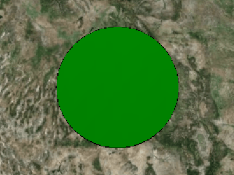
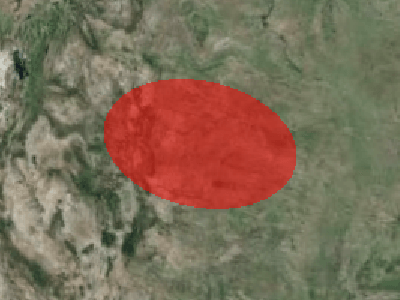
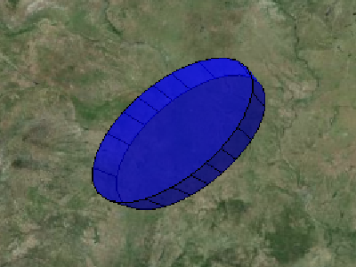

## [Ellipsoid](https://staven630.github.io/cesium-doc-zh/Ellipsoid.html)

| 名称                     | 类型                                                                                                                                                                       | 是否必填 | 默认值                         | 描述                                                                                                |
| :----------------------- | :------------------------------------------------------------------------------------------------------------------------------------------------------------------------- | :------- | :----------------------------- | :-------------------------------------------------------------------------------------------------- |
| show                     | [Property](https://staven630.github.io/cesium-doc-zh/Property.html) \| boolean                                                                                             | <可选>   | true                           | 指定椭圆的可见性。                                                                                  |
| semiMajorAxis            | [Property](https://staven630.github.io/cesium-doc-zh/Property.html) \| number                                                                                              | <可选>   |                                | 指定长半轴的数字属性。                                                                              |
| semiMinorAxis            | [Property](https://staven630.github.io/cesium-doc-zh/Property.html) \| number                                                                                              | <可选>   |                                | 指定短半轴的数字属性。                                                                              |
| height                   | [Property](https://staven630.github.io/cesium-doc-zh/Property.html) \| number                                                                                              | <可选>   | 0                              | 用于指定椭圆相对于椭球表面的高度。                                                                  |
| heightReference          | [Property](https://staven630.github.io/cesium-doc-zh/Property.html) \| [HeightReference](https://staven630.github.io/cesium-doc-zh/global.html#HeightReference)            | <可选>   | HeightReference.NONE           | 指定高度相对于什么的属性。                                                                          |
| extrudedHeight           | [Property](https://staven630.github.io/cesium-doc-zh/Property.html) \| number                                                                                              | <可选>   |                                | 用于指定椭圆的挤压面相对于椭球面的高度。                                                            |
| extrudedHeightReference  | [Property](https://staven630.github.io/cesium-doc-zh/Property.html) \| [HeightReference](https://staven630.github.io/cesium-doc-zh/global.html#HeightReference)            | <可选>   | HeightReference.NONE           | 指定了 extrudedHeight 相对于什么。                                                                  |
| rotation                 | [Property](https://staven630.github.io/cesium-doc-zh/Property.html) \| number                                                                                              | <可选>   | 0.0                            | 用于指定椭圆从北方逆时针旋转。                                                                      |
| stRotation               | [Property](https://staven630.github.io/cesium-doc-zh/Property.html) \| number                                                                                              | <可选>   | 0.0                            | 用于指定椭圆纹理从北方逆时针旋转。                                                                  |
| granularity              | [Property](https://staven630.github.io/cesium-doc-zh/Property.html) \| number                                                                                              | <可选>   | Cesium.Math.RADIANS_PER_DEGREE | 用于指定椭圆上各点之间的角距离。                                                                    |
| fill                     | [Property](https://staven630.github.io/cesium-doc-zh/Property.html) \| boolean                                                                                             | <可选>   | true                           | 用于指定椭圆是否填充了所提供的材料。                                                                |
| material                 | [MaterialProperty](https://staven630.github.io/cesium-doc-zh/MaterialProperty.html) \| [Color](https://staven630.github.io/cesium-doc-zh/Color.html)                       | <可选>   | Color.WHITE                    | 指定用于填充椭圆的材料。                                                                            |
| outline                  | [Property](https://staven630.github.io/cesium-doc-zh/Property.html) \| boolean                                                                                             | <可选>   | false                          | 用于指定是否勾勒出椭圆。                                                                            |
| outlineColor             | [Property](https://staven630.github.io/cesium-doc-zh/Property.html) \| [Color](https://staven630.github.io/cesium-doc-zh/Color.html)                                       | <可选>   | Color.BLACK                    | 指定 Color 轮廓的属性。                                                                             |
| outlineWidth             | [Property](https://staven630.github.io/cesium-doc-zh/Property.html) \| number                                                                                              | <可选>   | 1.0                            | 指定轮廓宽度的数字属性。                                                                            |
| numberOfVerticalLines    | [Property](https://staven630.github.io/cesium-doc-zh/Property.html) \| number                                                                                              | <可选>   | 16                             | 用于指定沿轮廓的周长绘制的垂直线的数量。                                                            |
| shadows                  | [Property](https://staven630.github.io/cesium-doc-zh/Property.html) \| [ShadowMode](https://staven630.github.io/cesium-doc-zh/global.html#ShadowMode)                      | <可选>   | ShadowMode.DISABLED            | 指定椭圆是否投射或接收来自光源的阴影。                                                              |
| distanceDisplayCondition | [Property](https://staven630.github.io/cesium-doc-zh/Property.html) \| [DistanceDisplayCondition](https://staven630.github.io/cesium-doc-zh/DistanceDisplayCondition.html) | <可选>   |                                | 它指定将在距相机的距离处显示此椭圆。                                                                |
| classificationType       | [Property](https://staven630.github.io/cesium-doc-zh/Property.html) \| [ClassificationType](https://staven630.github.io/cesium-doc-zh/global.html#ClassificationType)      | <可选>   | ClassificationType.BOTH        | 用于指定此椭圆在地面上时将对地形，3D 拼贴还是对两者进行分类。                                       |
| zIndex                   | [ConstantProperty](https://staven630.github.io/cesium-doc-zh/ConstantProperty.html) \| number                                                                              | <可选>   | 0                              | 指定椭圆的 zIndex。用于订购地面几何形状。仅在椭圆为常数且未指定 height 或 exturdedHeight 时才有效。 |

```js
viewer.entities.add({
  position: Cesium.Cartesian3.fromDegrees(-111.0, 40.0, 150000.0),
  ellipse: {
    semiMinorAxis: 300000.0,
    semiMajorAxis: 300000.0,
    height: 200000.0,
    material: Cesium.Color.GREEN,
    outline: true,
  },
});
```



```js
viewer.entities.add({
  position: Cesium.Cartesian3.fromDegrees(-103.0, 40.0),
  ellipse: {
    semiMinorAxis: 250000.0,
    semiMajorAxis: 400000.0,
    material: Cesium.Color.RED.withAlpha(0.5),
  },
});
```



```js
viewer.entities.add({
  position: Cesium.Cartesian3.fromDegrees(-95.0, 40.0, 100000.0),
  ellipse: {
    semiMinorAxis: 150000.0,
    semiMajorAxis: 300000.0,
    extrudedHeight: 200000.0,
    rotation: Cesium.Math.toRadians(45),
    material: Cesium.Color.BLUE.withAlpha(0.5),
    outline: true,
  },
});
```



- [Cesium Sandcastle Circles and Ellipses Demo](https://sandcastle.cesium.com/index.html?src=Circles%20and%20Ellipses.html)
