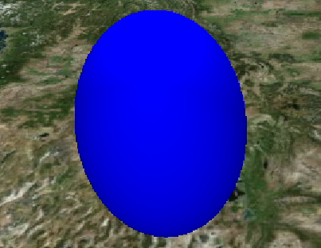
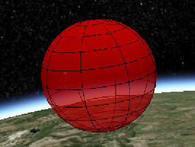

## [EllipsoidGraphics](https://staven630.github.io/cesium-doc-zh/EllipsoidGraphics.html)

| 名称                     | 类型                                                                                                                                                                       | 是否必填 | 默认值               | 描述                                         |
| :----------------------- | :------------------------------------------------------------------------------------------------------------------------------------------------------------------------- | :------- | :------------------- | :------------------------------------------- |
| show                     | [Property](https://staven630.github.io/cesium-doc-zh/Property.html) @@ boolean                                                                                             | <可选>   | true                 | 指定椭球体的可见性。                         |
| radii                    | [Property](https://staven630.github.io/cesium-doc-zh/Property.html) @@ [Cartesian3](https://staven630.github.io/cesium-doc-zh/Cartesian3.html)                             | <可选>   |                      | 用于指定椭球的半径。                         |
| innerRadii               | [Property](https://staven630.github.io/cesium-doc-zh/Property.html) @@ [Cartesian3](https://staven630.github.io/cesium-doc-zh/Cartesian3.html)                             | <可选>   |                      | 用于指定椭球的内部半径。                     |
| minimumClock             | [Property](https://staven630.github.io/cesium-doc-zh/Property.html) @@ number                                                                                              | <可选>   | 0.0                  | 指定椭圆形的最小时钟角度。                   |
| maximumClock             | [Property](https://staven630.github.io/cesium-doc-zh/Property.html) @@ number                                                                                              | <可选>   | 2\*PI                | 用于指定椭球的最大时钟角度。                 |
| minimumCone              | [Property](https://staven630.github.io/cesium-doc-zh/Property.html) @@ number                                                                                              | <可选>   | 0.0                  | 用于指定椭圆形的最小圆锥角。                 |
| maximumCone              | [Property](https://staven630.github.io/cesium-doc-zh/Property.html) @@ number                                                                                              | <可选>   | PI                   | 用于指定椭球的最大圆锥角。                   |
| heightReference          | [Property](https://staven630.github.io/cesium-doc-zh/Property.html) @@ [HeightReference](https://staven630.github.io/cesium-doc-zh/global.html#HeightReference)            | <可选>   | HeightReference.NONE | 指定距离实体位置的高度相对于什么。           |
| fill                     | [Property](https://staven630.github.io/cesium-doc-zh/Property.html) @@ boolean                                                                                             | <可选>   | true                 | 用于指定椭圆形是否填充了所提供的材料。       |
| material                 | [MaterialProperty](https://staven630.github.io/cesium-doc-zh/MaterialProperty.html) @@ [Color](https://staven630.github.io/cesium-doc-zh/Color.html)                       | <可选>   | Color.WHITE          | 指定用于填充椭圆形的材料。                   |
| outline                  | [Property](https://staven630.github.io/cesium-doc-zh/Property.html) @@ boolean                                                                                             | <可选>   | false                | 用于指定是否勾勒出椭圆形。                   |
| outlineColor             | [Property](https://staven630.github.io/cesium-doc-zh/Property.html) @@ [Color](https://staven630.github.io/cesium-doc-zh/Color.html)                                       | <可选>   | Color.BLACK          | 指定轮廓的 Color 属性。                      |
| outlineWidth             | [Property](https://staven630.github.io/cesium-doc-zh/Property.html) @@ number                                                                                              | <可选>   | 1.0                  | 指定轮廓宽度的数字属性。                     |
| stackPartitions          | [Property](https://staven630.github.io/cesium-doc-zh/Property.html) @@ number                                                                                              | <可选>   | 64                   | 一个指定堆栈数的属性。                       |
| slicePartitions          | [Property](https://staven630.github.io/cesium-doc-zh/Property.html) @@ number                                                                                              | <可选>   | 64                   | 一个指定径向切片数量的属性。                 |
| subdivisions             | [Property](https://staven630.github.io/cesium-doc-zh/Property.html) @@ number                                                                                              | <可选>   | 128                  | 用于指定每个轮廓环的样本数，确定曲率的粒度。 |
| shadows                  | [Property](https://staven630.github.io/cesium-doc-zh/Property.html) @@ [ShadowMode](https://staven630.github.io/cesium-doc-zh/global.html#ShadowMode)                      | <可选>   | ShadowMode.DISABLED  | 用于指定椭圆体是否投射或接收来自光源的阴影。 |
| distanceDisplayCondition | [Property](https://staven630.github.io/cesium-doc-zh/Property.html) @@ [DistanceDisplayCondition](https://staven630.github.io/cesium-doc-zh/DistanceDisplayCondition.html) | <可选>   |                      | 它指定将在距相机的距离上显示此椭球。         |

```js
viewer.entities.add({
  position: Cesium.Cartesian3.fromDegrees(-114.0, 40.0, 300000.0),
  ellipsoid: {
    radii: new Cesium.Cartesian3(200000.0, 200000.0, 300000.0),
    material: Cesium.Color.BLUE,
  },
});
```



```js
viewer.entities.add({
  position: Cesium.Cartesian3.fromDegrees(-107.0, 40.0, 300000.0),
  ellipsoid: {
    radii: new Cesium.Cartesian3(300000.0, 300000.0, 300000.0),
    material: Cesium.Color.RED.withAlpha(0.5),
    outline: true,
    outlineColor: Cesium.Color.BLACK,
  },
});
```



```js
```


## 示例

- [Cesium Sandcastle Spheres and Ellipsoids Demo](https://sandcastle.cesium.com/index.html?src=Spheres%2520and%2520Ellipsoids.html)
