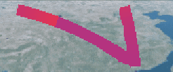

素材图篇


> CustomMaterialProperty.js

```js
import * as Cesium from "cesium";

import flowImg from "./flowMap.png";

class CustomMaterialProperty {
  /**
   * 构建材质Property构造器
   * @param options
   */
  constructor(options) {
    options = Cesium.defaultValue(options, Cesium.defaultValue.EMPTY_OBJECT);
    this._definitionChanged = new Cesium.Event(); // cesium事件
    this._time = new Date().getTime(); // 初始时间
    this._color = Cesium.Color.RED; // 默认初始颜色
    this._duration = 3000; // 默认初始耗时
    this._trailImage = flowImg; // 默认初始纹理
    this.color = options.color ? options.color : this._color; // 初始化赋值
    this.duration = options.duration ? options.duration : this._duration; // 初始化赋值
    this.trailImage = options.trailImage
      ? options.trailImage
      : this._trailImage; // 初始化赋值
  }
}
// 在一个对象上定义新的属性或修改现有属性，并返回该对象
Object.defineProperties(CustomMaterialProperty.prototype, {
  isConstant: {
    get: function() {
      return (
        Cesium.Property.isConstant(this._color) &&
        Cesium.Property.isConstant(this._duration) &&
        Cesium.Property.isConstant(this._trailImage)
      );
    },
  },

  definitionChanged: {
    get: function() {
      return this._definitionChanged;
    },
  },
  color: Cesium.createPropertyDescriptor("color"),
});

// 在提供的时间获取 Material 类型。
CustomMaterialProperty.prototype.getType = function(time) {
  return "Custom";
};

// 在提供的时间获取属性的值。
CustomMaterialProperty.prototype.getValue = function(time, result) {
  if (!Cesium.defined(result)) {
    result = {};
  }
  result.color = Cesium.Property.getValueOrClonedDefault(
    this._color,
    time,
    this._color,
    result.color
  );
  result.image = this.trailImage;
  result.time =
    ((new Date().getTime() - this._time) % this.duration) / this.duration;
  return result;
};
// 将此属性与提供的属性进行比较并返回如果相等，则为 true ，否则为 false
CustomMaterialProperty.prototype.equals = function(other) {
  return (
    this === other ||
    (other instanceof CustomMaterialProperty &&
      Cesium.Property.equals(this._color, other._color) &&
      Cesium.Property.equals(this._time, other._time) &&
      Cesium.Property.equals(this._duration, other._duration) &&
      Cesium.Property.equals(this._trailImage, other._trailImage))
  );
};

// 定义材质的类型，纹理，材质着色器
Cesium.Material.CustomType = "Custom";
Cesium.Material.CustomImage = flowImg;
Cesium.Material.CustomSource = `czm_material czm_getMaterial(czm_materialInput materialInput)
{
    czm_material material = czm_getDefaultMaterial(materialInput);
    vec2 st = materialInput.st;
    vec4 colorImage = texture2D(image, vec2(fract(st.s - time), st.t));
    material.alpha = colorImage.a * color.a;
    material.diffuse = (colorImage.rgb+color.rgb)/2.0;
    material.specular = (colorImage.r+color.r);
    return material;
}`;

// 给cesium添加材质类型，颜色，着色器，初始化uniforms
Cesium.Material._materialCache.addMaterial(Cesium.Material.CustomType, {
  fabric: {
    type: Cesium.Material.CustomType,
    uniforms: {
      color: new Cesium.Color(0.0, 0.0, 0.0, 0.0),
      image: Cesium.Material.CustomImage,
      time: 0,
    },
    source: Cesium.Material.CustomSource,
  },
  translucent: function(material) {
    return material.uniforms.color.alpha < 1.0;
  },
});

export default CustomMaterialProperty;
```

```js
viewer.entities.add({
  name: "polyline",
  polyline: {
    positions: Cartesian3.fromDegreesArray([
      90.82436,
      38.071506,
      112.82742,
      23.067512,
      112.832166,
      40.058329,
    ]),
    material: new CustomMaterialProperty(),
    width: 20,
  },
});
```


