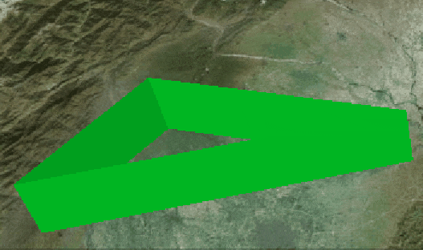

## 颜色材质：[ColorMaterialProperty](https://staven630.github.io/cesium-doc-zh/ColorMaterialProperty.html)

| 名称  | 类型                                                                                                                                 | 默认值      | 是否可选 | 描述                |
| :---- | :----------------------------------------------------------------------------------------------------------------------------------- | :---------- | :------- | ------------------- |
| color | [Property](https://staven630.github.io/cesium-doc-zh/Property.html) \| [Color](https://staven630.github.io/cesium-doc-zh/Color.html) | Color.white | 可选     | 要使用的 Color 属性 |

```js
const colorProperty = new Cesium.SampledProperty(Cesium.Color);

colorProperty.addSample(
  Cesium.JulianDate.fromDate(new Date()),
  new Cesium.Color(0, 1, 0)
);

colorProperty.addSample(
  Cesium.JulianDate.addSeconds(
    Cesium.JulianDate.fromDate(new Date()),
    5,
    new Cesium.JulianDate()
  ),
  new Cesium.Color(0, 0, 1)
);

viewer.entities.add({
  position: Cesium.Cartesian3.fromDegrees(103.842575, 30.795808),
  polygon: {
    hierarchy: {
      positions: Cesium.Cartesian3.fromDegreesArray([
        103.842575,
        30.795808,
        104.394638,
        30.728545,
        104.394638,
        30.728545,
        103.626969,
        30.584419,
      ]),
    },
    material: new Cesium.ColorMaterialProperty(colorProperty),
    height: 20000.0,
    extrudedHeight: 40000.0,
    closeTop: false,
    closeBottom: false,
  },
});
```


