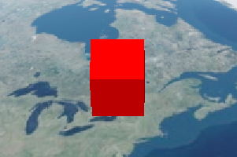

## [BoxGeometry](https://staven630.github.io/cesium-doc-zh/BoxGeometry.html)

| 名称         | 类型                                                                        | 默认值               | 是否可选 | 描述                      |
| :----------- | :-------------------------------------------------------------------------- | :------------------- | :------- | ------------------------- |
| minimum      | [Cartesian3](https://staven630.github.io/cesium-doc-zh/Cartesian3.html)     |                      |          | 框的最小 x，y 和 z 坐标。 |
| maximum      | [Cartesian3](https://staven630.github.io/cesium-doc-zh/Cartesian3.html)     |                      |          | 框的最大 x，y 和 z 坐标。 |
| vertexFormat | [VertexFormat](https://staven630.github.io/cesium-doc-zh/VertexFormat.html) | VertexFormat.DEFAULT | 可选     | 要计算的顶点属性          |

### 创建方式

- [Cesium.BoxGeometry.createGeometry(boxGeometry)](https://staven630.github.io/cesium-doc-zh/BoxGeometry.html#.createGeometry) → Geometry \| undefined

```js
const viewer = new Cesium.Viewer("cesiumContainer");

const box = new Cesium.BoxGeometry({
  vertexFormat: Cesium.PerInstanceColorAppearance.VERTEX_FORMAT,
  maximum: new Cesium.Cartesian3(250000.0, 250000.0, 250000.0),
  minimum: new Cesium.Cartesian3(-250000.0, -250000.0, -250000.0),
});

const boxGeometry = Cesium.BoxGeometry.createGeometry(box);

const boxGeometryInstance = new Cesium.GeometryInstance({
  geometry: boxGeometry,
  modelMatrix: Cesium.Matrix4.multiplyByTranslation(
    Cesium.Transforms.eastNorthUpToFixedFrame(
      Cesium.Cartesian3.fromDegrees(-75.59777, 40.03883)
    ),
    new Cesium.Cartesian3(0.0, 0.0, 1000000.0),
    new Cesium.Matrix4()
  ),
  attributes: {
    color: Cesium.ColorGeometryInstanceAttribute.fromColor(Cesium.Color.RED),
  },
  id: "bottom",
});

const primitive = new Cesium.Primitive({
  geometryInstances: [boxGeometryInstance],
  asynchronous: false,
  appearance: new Cesium.PerInstanceColorAppearance({
    translucent: false,
    closed: true,
  }),
});

viewer.scene.primitives.add(primitive);
```



- [Cesium.BoxGeometry.fromAxisAlignedBoundingBox(boundingBox)](https://staven630.github.io/cesium-doc-zh/BoxGeometry.html#.fromAxisAlignedBoundingBox) → BoxGeometry

```js
const viewer = new Cesium.Viewer("cesiumContainer");

const points = Cesium.AxisAlignedBoundingBox.fromPoints(
  Cesium.Cartesian3.fromDegreesArray([
    -72.0,
    40.0,
    -70.0,
    35.0,
    -75.0,
    30.0,
    -70.0,
    30.0,
    -68.0,
    40.0,
  ])
);

const boxGeometry = Cesium.BoxGeometry.fromAxisAlignedBoundingBox(points);

const boxGeometryInstance = new Cesium.GeometryInstance({
  geometry: boxGeometry,
  attributes: {
    color: Cesium.ColorGeometryInstanceAttribute.fromColor(Cesium.Color.GREEN),
  },
  id: "center",
});

const primitive = new Cesium.Primitive({
  geometryInstances: [boxGeometryInstance],
  asynchronous: false,
  appearance: new Cesium.PerInstanceColorAppearance({
    translucent: false,
    closed: true,
  }),
});

viewer.scene.primitives.add(primitive);
```


- [Cesium.BoxGeometry.fromDimensions(options)](https://staven630.github.io/cesium-doc-zh/BoxGeometry.html#.fromDimensions) → BoxGeometry

```js
const viewer = new Cesium.Viewer("cesiumContainer");

const box = Cesium.BoxGeometry.fromDimensions({
  vertexFormat: Cesium.PerInstanceColorAppearance.VERTEX_FORMAT,
  dimensions: new Cesium.Cartesian3(500000.0, 500000.0, 500000.0),
});

const boxGeometry = Cesium.BoxGeometry.createGeometry(box);

const boxGeometryInstance = new Cesium.GeometryInstance({
  geometry: boxGeometry,
  modelMatrix: Cesium.Matrix4.multiplyByTranslation(
    Cesium.Transforms.eastNorthUpToFixedFrame(
      Cesium.Cartesian3.fromDegrees(-75.59777, 40.03883)
    ),
    new Cesium.Cartesian3(0.0, 0.0, 3000000.0),
    new Cesium.Matrix4()
  ),
  attributes: {
    color: Cesium.ColorGeometryInstanceAttribute.fromColor(Cesium.Color.BLUE),
  },
  id: "top",
});

const primitive = new Cesium.Primitive({
  geometryInstances: [boxGeometryInstance],
  asynchronous: false,
  appearance: new Cesium.PerInstanceColorAppearance({
    translucent: false,
    closed: true,
  }),
});

viewer.scene.primitives.add(primitive);
```


