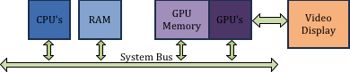
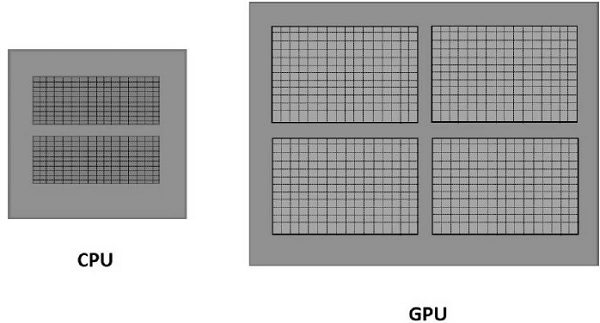
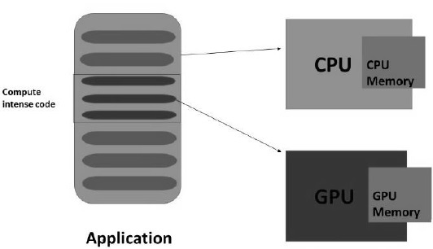
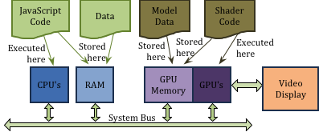

## WebGL 概念

&emsp;&emsp;WebGL 是一种 JavaScript 应用程序编程接口(API),可在任何兼容的 Web 浏览器中使用计算设备的图形处理单元 (GPU) 来呈现实时 2D/3D 计算机图形，而无需使用插件。WebGL 通过引入一个与 OpenGL ES 2.0 非常一致的 API 来做到这一点，该 API 可以在 HTML5 \<canvas>元素中使用。 这种一致性使 API 可以利用用户设备提供的硬件图形加速。

## WebGL 程序

&emsp;&emsp;WebGL 程序的基本组成部分：

- HTML
- CSS
- HTML canvas 元素
- 要渲染的 3D 对象的图形数据
- 加载、配置、渲染图像数据以及响应事件的 JavaScript 程序
- 执行图形渲染关键部分的 OpenGL 着色器程序

## GPU

&emsp;&emsp;现代计算设备具有多个不同类型的处理器：

- CPU（中央处理单元）：是设备的“大脑”。CPU 执行一般处理并运行控制设备整体功能的操作系统 (OS)。
- GPU（图形处理单元）：专门设计用于渲染 3D 图形。

&emsp;&emsp;现代计算设备还具有未不同目的而设计的多种类型的存储器：

- RAM（随机存取存储器）：存储程序数据和程序指令。
- 图形内存：用于视频和图形处理的独立内存系统。GPU 具有专为 3D 图形设计的专用内存。

##### 图形处理器

&emsp;&emsp;根据 NVIDIA 的说法，GPU 是“具有集成变换、照明、三角形设置/裁剪和渲染引擎的单芯片处理器，能够每秒处理至少 1000 万个多边形。” 与具有针对顺序处理优化的几个内核的多核处理器不同，GPU 由数千个较小的内核组成，可以高效地处理并行工作负载。因此，GPU 加速了帧缓冲区（包含完整帧数据的 RAM 的一部分）中图像的创建，用于输出到显示器。

##### GPU 加速计算

在 GPU 加速计算中，应用程序被加载到 CPU 中。每当遇到计算密集型代码部分时，就会加载该部分代码并在 GPU 上运行。它使系统能够以有效的方式处理图形。

&emsp;&emsp;GPU 将有一个单独的内存，它一次运行一小部分代码的多个副本。GPU 处理其本地内存中的所有数据，而不是中央内存。因此，需要 GPU 处理的数据应该加载/复制到 GPU 内存，然后进行处理。

&emsp;&emsp;在具有上述架构的系统中，应该减少 CPU 和 GPU 之间的通信开销以实现更快的 3D 程序处理。为此，我们必须复制所有数据并将其保存在 GPU 上，而不是反复与 GPU 通信。

## 请求渲染流程

&emsp;&emsp;当客户端从 Web 服务器请求网页时，会发生以下事件序列：

1. 服务器将网页的 HTML 描述发送给客户端，客户端将网页存储在 RAM 中。

2. 客户端的 Web 浏览器读取 HTML 页面内容并请求 HTML 代码中引用的任何其他文档，包括图像、JavaScript、CSS 等文件。所有这些文件都存储在客户端的 RAM 中。

3. 如果有与页面关联的 JavaScript 代码，它就会被执行。对于包含 3D 图形的页面，JavaScript 代码将执行以下任务：
   - 它可能会请求从服务器下载其他数据文件（例如，描述要渲染的 3D 图形对象的数据）。
   - 它将获取并初始化与将呈现图形的 HTML 画布元素关联的 WebGL 图形上下文。
   - 它将配置模型数据并将其复制到 GPU 的内存中。（从技术上讲，数据被复制到 GPU 的顶点对象缓冲区）。
   - 它将建立“事件处理程序”，将 HTML 事件与将在事件发生时执行的 JavaScript 代码相关联。
4. 最后，网页被渲染到浏览器中的一个窗口，网页等待用户事件。定时器事件可以设置为定期自动生成事件，这可以创建 3D 图形的动画。

&emsp;&emsp;当 JavaScript 事件处理程序启动将图形渲染到 HTML canvas 元素中时，它会告诉 GPU 哪个对象缓冲区包含它想要渲染的数据，然后发出 WebGL“draw”命令。请注意，要渲染的数据通常已经在 GPU 内存中。在典型的图形程序中，模型数据仅被复制到 GPU 的内存一次。这可以节省时间并使图形渲染高效快速。当我们使用术语“real-time graphics”时，我们的意思是可以在不到 1/30 秒的时间内完成渲染，并且用户可以查看流畅的图形动画。只有最大限度地减少 GPU 内存和 RAM 之间的数据传输，才能实现如此快速的渲染。

