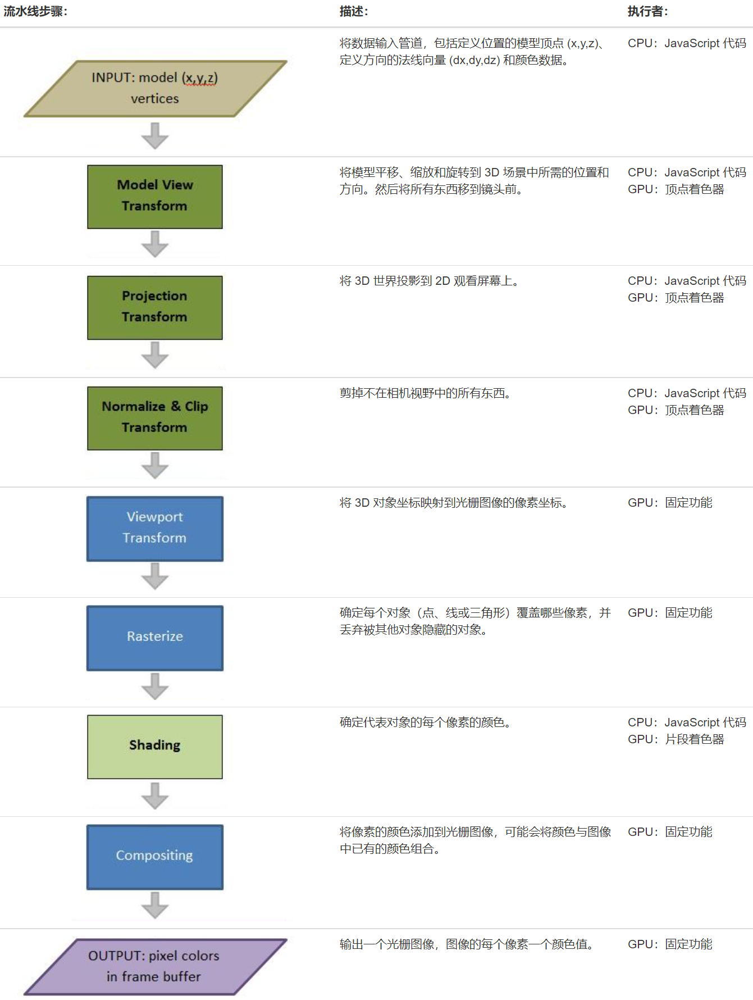

## 图形分类

&emsp;&emsp;计算机描述图形有两种基本方式：

- 光栅图形

  &emsp;&emsp;使用像素点描述图形，如果这些点足够小并且靠得足够近，就看不到是单个点，而是一张“图片”

- 矢量图形

  &emsp;&emsp;使用数学方程将对象描述为几何形状。图片是通过渲染过程根据数学描述创建的，渲染的结果是二维光栅图像。

&emsp;&emsp;3D 计算机图形是使用几何数据的三维表示来执行计算、渲染 2D 图像的图形。

## 图形管道

&emsp;&emsp;将对象的矢量图形表示转换为光栅图像的过程由以下步骤执行：

